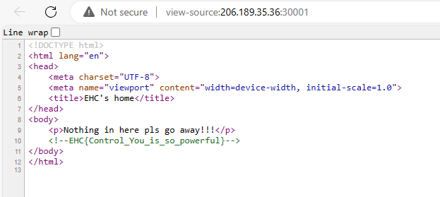

<h1 align="center"> :metal: EHC Qual Writeup :metal: </h1>

## WEB

- **Web 01** Tổ hợp phím được sử dụng khi bạn muốn xem source code của 1 trang web là gì?  **EHC{ctrl_u}**

- **Web 02**
  Có một tệp văn bản đặt ở gốc trang web và chứa các chỉ thị cho các robots.Tìm ra tên của file đang được nói ở trên! **EHC{robots.txt}**

- **Web 03**
  Với 1 website làm bài thi online, ta sẽ lưu bài làm chưa hoàn thiện của thí sinh vào session hay cookie?
  **EHC{cookie}**

- **Web 04**
  Các thư mục con nằm bên trong root directory được gọi là gì?
  **EHC{subdirectory}**

- **Web 05**
  Tên của cách thức tấn công thực thi mã từ xa là gì?
  **EHC{RCE}**

- **Web 06**
  Bạn có biết tên của bộ công cụ bảo mật ứng dụng web được phát triển bởi PortSwigger không?
  **EHC{burpsuite}**

- **C0ntr0l U**
  Flag đã bị giấu ở đâu đó trong trang [web](http://206.189.35.36:30001) này, hãy check thật kĩ mọi nơi mà bạn có thể check!!!

  > Bằng ctrl + u , ta có thể dễ dàng lấy được flag
  >
  > 

- **Hidden text!!!**
  Find hidden text in this [web](http://206.189.35.36:30005/)

  > Trong web có đưa ra gợi ý ""