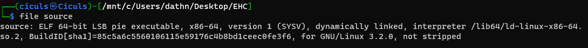

<h1 align="center"> :metal: EHC Qual Writeup :metal: </h1>

## WEB

- **Web 01** Tổ hợp phím được sử dụng khi bạn muốn xem source code của 1 trang web là gì?

  **EHC{ctrl_u}**

- **Web 02**
  Có một tệp văn bản đặt ở gốc trang web và chứa các chỉ thị cho các robots.Tìm ra tên của file đang được nói ở trên!

  **EHC{robots.txt}**

- **Web 03**
  Với 1 website làm bài thi online, ta sẽ lưu bài làm chưa hoàn thiện của thí sinh vào session hay cookie?

  **EHC{cookie}**

- **Web 04**
  Các thư mục con nằm bên trong root directory được gọi là gì?

  **EHC{subdirectory}**

- **Web 05**
  Tên của cách thức tấn công thực thi mã từ xa là gì?

  **EHC{RCE}**

- **Web 06**
  Bạn có biết tên của bộ công cụ bảo mật ứng dụng web được phát triển bởi PortSwigger không?

  **EHC{burpsuite}**

- **C0ntr0l U**
  Flag đã bị giấu ở đâu đó trong trang [web](http://206.189.35.36:30001) này, hãy check thật kĩ mọi nơi mà bạn có thể check!!!

  > Bằng ctrl + u , ta có thể dễ dàng lấy được flag
  >
  > 


- **Hidden text!!!**
  Find hidden text in this [web](http://206.189.35.36:30005/)

  > Trong web có đưa ra gợi ý "I need to find some robots" , vì vậy flag có thể đang nằm tại file robots.txt, kiểm tra thử , có thể thấy flag ở đó.
  >
  > 


- **Senna-Qiyana-Lucian**
  Login in to this [web](http://206.189.35.36:30004/) as candidate to get the flag!

  > Nhìn thoáng qua thì nó là 1 trang login bình thường , thử SQLI bằng dấu nháy đơn ( ' ), ta thấy được sql debug , có thể khai thac SQLi. Bằng payload đơn giản "'or'1=1" , khai thác lỗi thành công , server trả flag.
  >
  > 


## Crypto

- **Basic_XOR**
  Cho b=181611 và c=520999. Tìm a sao cho a^b=c?

  > a^b=c --&gt; c^b=a

  **EHC{341580}**

## Forensic

- **Comment command**
  Bạn có biết câu lệnh có thể xem được metadata?

  **EHC{exiftool}**
- **Hello Shark**
  File PCAP là loại file gì?

  **EHC{packetcapturedata}**
- **Oh! Shark is cute!**
  Mình muốn xem được file PCAP thì cần phải sử dụng tool nào thế nhỉ?

  **EHC{wireshark}**
- **Hexi Swan**
  Hex signature header of image encoded in the Portable Network Graphics format

  **EHC{89504E470D0A1A0A}**
- **Comment more command**
  Bức ảnh này có gì thú vị không nhỉ?

  > Nhìn qua thì là bức ảnh thiên nga bình thường, check metadata thì thấy ở phần artist có flag
  >
  > 


  > Dùng python để trừ kí tự, kết quả là 13
  >
  > 


  > Tiếp theo dùng cyberchef và ROT13 để giải flag
  >
  > 


  **EHC{M3t4d4t4_w1th_sw4n}**

## Binary Exploit

- **Binary Exploit 01**
  File source thuộc loại file nào?

  > Dùng "file" để check loại file của source
  >
  > 


- **Binary Exploit 02**
  Arch của file source là gì?

  > Tương tự như BE1 , ta dùng "checksec" để kiểm tra Arch của source
  >
  > 


  - **Binary Exploit 03**
    Có những chế độ bảo vệ nào được bật (enabled) trên file source?

  > Tương tự như BE2 , ta dùng "checksec" để kiểm tra protector của source
  >
  > 


  > Có PIE và NX đang được bật

  - **Binary Exploit 04**
    Trong hàm main, hàm nào là nguyên nhân chính xảy ra lỗi và câu lệnh nào là yếu tố gây lỗi trong bài này.

    **EHC{vuln_puts}**

    > puts gây lỗi do không giới hạn kí tự nhập.
  - Binary Exploit 05

    **Đã quên:)))**
  - **Binary Exploit 06**
    Chạy file source trên linux. Tiến hành nhập input vào trường **name**. Bạn có thể nhập được tối đa bao nhiêu kí tự ?

    > Đọc src code thì nhập được 0x30 = 48 kí tự.

## Reverse Engineering

> **Hầu như các bài trong RE e đều dùng Chatgpt và không nhớ kết quả!!!**

## Bonus

- **Base_Encode**

> Viết lại 1 đoạn code bằng python

```python
import base64

def caesar_decipher_bytes(data, shift):
    result = []
    for byte in data:
        if 65 <= byte <= 90:
            result.append((byte - 65 - shift) % 26 + 65)
        elif 97 <= byte <= 122:
            result.append((byte - 97 - shift) % 26 + 97)
        elif 48 <= byte <= 57:
            result.append((byte - 48 - shift) % 10 + 48)
        else:
            result.append(byte)
    return result

# Read the hexadecimal representation from the file
with open("cipher.txt", "r") as file:
    cipher_hex = file.read()

# Convert the hexadecimal string back to bytes
cipher_bytes = bytes.fromhex(cipher_hex)

# Reverse the Caesar cipher with a shift of -17
deciphered_caesar = caesar_decipher_bytes(cipher_bytes, 17)

# Base32hex decode the result to obtain the original message
decrypted_message = base64.b32hexdecode(bytes(deciphered_caesar))

# Print the decrypted message
print("Decrypted message:", decrypted_message.decode('utf-8'))
```

> Ta giải ra được đáp án
>
> 

